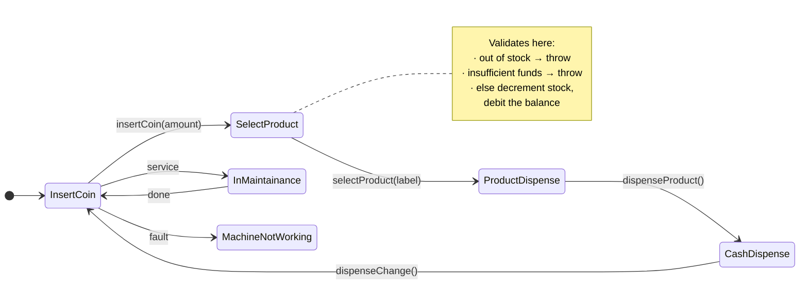
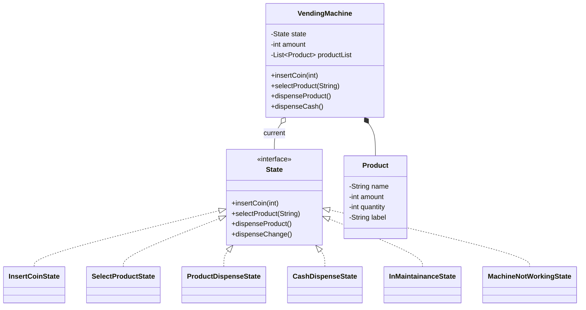

<div align="center">

# 🥤 Vending Machine — Low Level Design

**The State pattern, doing the job `if` statements usually get stuck with.**

A vending machine where "what happens when you press this button" depends entirely on
which state the machine is in — and each state answers for itself.


[Problem](#-the-problem) · [Design](#-the-design) · [States](#-the-state-machine) · [Run it](#-run-it)

</div>

---

## 📋 The problem

> Design a vending machine.
>
> - A user can insert a coin
> - After that they can select a product
> - The product inventory is updated
> - The product is dispensed
> - The user gets change, if any
> - The machine returns to its original state

## 💡 The design

The naive version of this is one class with a `status` field and a `switch` in every method:

```java
public void selectProduct(String label) {
    if (status == INSERT_COIN)      System.out.println("insert a coin first");
    else if (status == SELECTING)   { /* real logic */ }
    else if (status == DISPENSING)  System.out.println("wait");
    else if (status == MAINTENANCE) System.out.println("out of order");
    // ...and the same ladder repeated in insertCoin, dispenseProduct, dispenseChange
}
```

Every new state means editing every method — the exact thing the Open/Closed Principle warns about.

**The State pattern inverts it.** Each state is a class implementing the same interface, and every
state answers all four operations — including the ones that are invalid *for it*:

```java
public interface State {
    void insertCoin(int amount);
    void selectProduct(String label);
    void dispenseProduct();
    void dispenseChange();
}
```

`InsertCoinState.selectProduct()` says *"Please insert coin first."* `SelectProductState.insertCoin()`
says *"you already inserted the coin."* Invalid transitions become **data** — a method on a class —
rather than a branch in a conditional. Adding a state means adding a file, not editing six of them.

## 🔄 The state machine



| State | Accepts | Rejects with a message |
|---|---|---|
| **InsertCoinState** | `insertCoin` | select · dispense · change |
| **SelectProductState** | `selectProduct` | insertCoin ("already inserted") · dispense |
| **ProductDispenseState** | `dispenseProduct` | the rest |
| **CashDispenseState** | `dispenseChange` | the rest |
| **InMaintainanceState** | — | everything, while servicing |
| **MachineNotWorkingState** | — | everything, when faulted |

## 🏗 Structure



`VendingMachine` constructs all six states once and holds a reference to the current one.
Each state holds a back-reference to the machine, so it can read and mutate shared data —
balance, selected label, inventory — without that data leaking into the state classes themselves.

## ▶️ Run it

```bash
git clone https://github.com/prakashshuklahub/Vending-Maching-LLD.git
cd Vending-Maching-LLD
javac -d out $(find src -name '*.java')
java -cp out app.VendingMachineApplication
```

The demo runs two full purchase cycles against a machine stocked with `A1` diet coke (₹50, qty 2)
and `A2` chips (₹20, qty 2):

```java
vendingMachine.insertCoin(60);
vendingMachine.selectProduct("A1");
vendingMachine.dispenseProduct();
vendingMachine.dispenseCash();
```

## 🎯 Patterns used

| Pattern | Where | Why |
|---|---|---|
| **State** | `State` + six implementations | Behaviour varies by state; invalid operations are handled per-state instead of by conditionals |
| **Composition over inheritance** | `VendingMachine` holds a `State` | The machine changes behaviour at runtime by swapping the reference |

## 🔭 Known limitations

Honest list — this is a design exercise, not a production machine:

- **Change calculation is not denominational.** Balance is tracked as a single integer; there's no coin-inventory model deciding *which* coins to return.
- **Transitions are driven by the caller**, not by the states. `VendingMachine.insertCoin()` advances the state after delegating, so an invalid call still moves the machine forward. Having each state set the next one would be the stronger version.
- **Errors throw `RuntimeException`.** Out-of-stock and insufficient-funds deserve typed exceptions the caller can handle.
- **`InMaintainanceState` and `MachineNotWorkingState` are wired but unreachable** from the demo — no trigger transitions into them yet.

---

<div align="center">

Part of a low-level design series by **[Prakash Shukla](https://github.com/prakashshuklahub)**

[The Hustling Engineer](https://www.youtube.com/@TheHustlingEngineer) · [LinkedIn](https://www.linkedin.com/in/prakash-shukla/)

</div>
